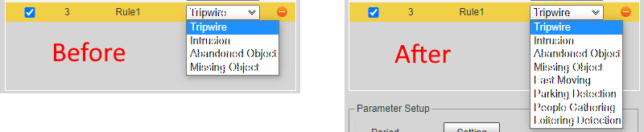

# Dahua-IVS-Unlock
A bookmarklet to unlock IVS rules on Dahua cameras

Here's a bookmarklet to unlock the following IVS rules in case you're missing them:

- Abandoned Object
- Missing Object
- Fast Moving
- Parking Detection
- People Gathering
- Loitering Detection

## Instructions:

**1)** Create a new bookmark with the following address:

```
javascript:(function()%7Bconst%20newOptions%3D%5B%7Bname%3A%22Abandoned%20Object%22%2Cvalue%3A%22LeftDetection%22%7D%2C%7Bname%3A%22Missing%20Object%22%2Cvalue%3A%22TakenAwayDetection%22%7D%2C%7Bname%3A%22Fast%20Moving%22%2Cvalue%3A%22MoveDetection%22%7D%2C%7Bname%3A%22Parking%20Detection%22%2Cvalue%3A%22ParkingDetection%22%7D%2C%7Bname%3A%22People%20Gathering%22%2Cvalue%3A%22RioterDetection%22%7D%2C%7Bname%3A%22Loitering%20Detection%22%2Cvalue%3A%22WanderDetection%22%7D%5D%2CselectObserver%3Dnew%20MutationObserver((()%3D%3E%7Bconst%20e%3Ddocument.querySelectorAll(%22%23ivs_ruleManager%20%3E%20*%20select%22)%3Be.length%3E0%26%26e.forEach((e%3D%3E%7Bconst%20t%3DArray.from(e.querySelectorAll(%22option%22)).map((e%3D%3Ee.value))%3BnewOptions.forEach((n%3D%3E%7Bif(!t.includes(n.value))%7Bconst%20t%3Ddocument.createElement(%22option%22)%3Bt.value%3Dn.value%2Ct.text%3Dn.name%2Ce.add(t)%7D%7D))%7D))%7D))%3BselectObserver.observe(document.body%2C%7BchildList%3A!0%2Csubtree%3A!0%7D)%3B%7D)()%3B
```

**2)** Go to the IVS rules page

**3)** Open the bookmark and add a new IVS rule. Edit the parameters and save.

**NOTES:**

The Rule Type will reset to the first entry when you select a new unlocked rule. This is fine and merely cosmetic. Internally the Rule Type will be properly set. You can verify this by looking at the rule's setup parameters.

After saving the new rules, you DO NOT need to run this bookmarklet again. The settings will stick. You can even come back later and adjust the setup parameters if you wish.

This has been tested only on cameras with the IPC-HX5X3X firmware. However, it should work on others with the same web layout.


